## Deep Predictive Coding Network for Object Recognition

###### 2018
###### Haiguang Wen, Kuan Han, Junxing Shi, Yizhen Zhang, Eugenio Culurciello, Zhongming Liu

---
<!-- # ----- ----- ----- The Definition of the PCN ----- ----- ----- # -->
<!-- footer: Deep Predictive Coding Network for Object Recognition -->
<!-- _backgroundColor: white -->

###  Predictive Coding Networks (PCN)

##### Based on the predictive coding theory in neuroscience,it was designed a bi-directional and recurrent neural net

---
<!-- # ----- ----- ----- keywards for PCN ----- ----- ----- # -->
#### Predictive Coding Networks (PCN)
##### keywards
- feedforward
- feedback
- recurrent connections
- bottom-up
- top-down

---
<!-- # ----- ----- ----- intro PCN 1 ----- ----- ----- # -->
<!-- footer: Introduction -->

###### CNNs have achieved great success in image recognition.

###### CNNs have improved the performance in CV(Computer Vision), while these models generally become deeper and wider by using more layers or/and fillters.

<!-- # ----- ----- ----- Script ----- ----- ----- # -->
<!--
CNNs have achieved great success in image recognition.
CNNs have improved the performance in CV(Computer Vision), while these models generally become deeper and wider by using more layers or/and fillters. For example, AlexNet, VGG, GoogLeNet, ResNet, ...
-->
<!-- # ----- ----- ----- ----- ----- ----- ----- ----- # -->
---
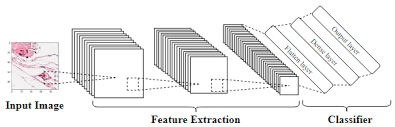
###### Despite various ways of architectural reconfiguration, 
###### these models all scale up from the same principle of computation

###### : extracting image features by a feedforward pass through stacks of convolutional layers.

<!-- # ----- ----- ----- Script ----- ----- ----- # -->
<!-- 
Despite various ways of architectural reconfiguration, these models all scale up from the same principle of computation: extracting image features by a feedforward pass through stacks of convolutional layers.
-->
<!-- # ----- ----- ----- ----- ----- ----- ----- ----- # -->
--- 
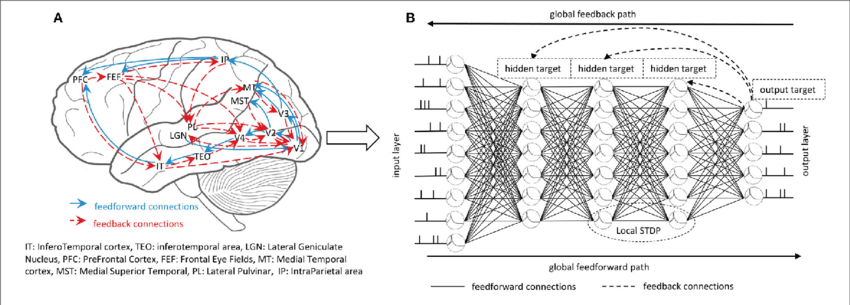
###### **_Unlike CNNs_**, the brain achieves robust visual perception by using feedforward, feedback and recurrent connections(Felleman & Van, 1991)
     
###### Such bi-directional processes enable humans to perform a wide range of visual tasks, including object recognition.

<!-- # ----- ----- ----- Script ----- ----- ----- # -->
<!-- 
Although it is inspired by hierarchical processing in biological visual systems,
CNN differs from the brain in many aspects.
**_Unlike CNNs_**, the brain achieves robust visual perception by using feedforward, feedback and recurrent connections.

Information is processed not only through a bottom-up path-way running from lower to higher visual areas, but also through a top-down pathway running in the opposite direction.
Such bi-directional processes enable humans to perform a wide range of visual tasks, including object recognition.
-->
<!-- # ----- ----- ----- ----- ----- ----- ----- ----- # -->
---
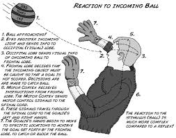

###### For human vision, feedforward processing is essential to rapid recognition,
###### when visual input is too brief to recruit feedback and recurrent processing.

<!-- # ----- ----- ----- Script ----- ----- ----- # -->
<!-- 
For human vision, feedforward processing is essential to rapid recognition, when visual input is too brief to recruit feedback and recurrent processing.
-->
<!-- # ----- ----- ----- ----- ----- ----- ----- ----- # -->
---
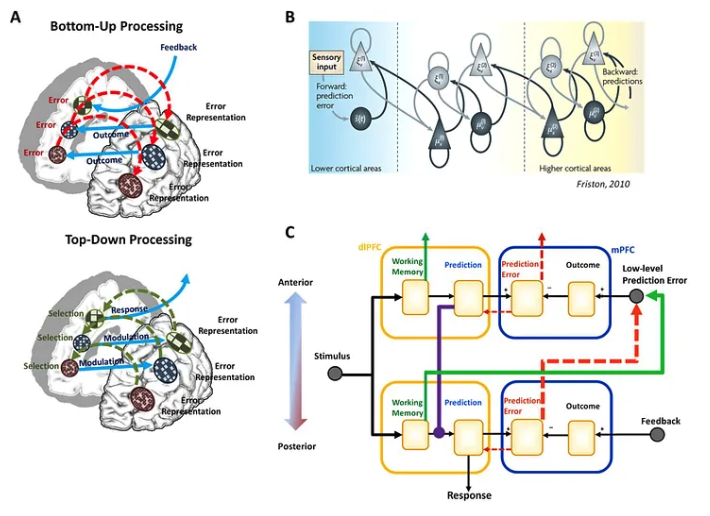
###### However, feedback processing improves object recognition and enables cognitive processes to influence perception.

###### In neuroscience, the interplay between feedforward and feedback processes is described by hierarchical predictive coding.

<!-- # ----- ----- ----- Script ----- ----- ----- # -->
<!--
However, feedback processing improves object recognition and enables cognitive processes to influence perception.
In neuroscience, the interplay between feedforward and feedback processes is described by hierarchical predictive coding.
-->
<!-- # ----- ----- ----- ----- ----- ----- ----- ----- # -->
---
###### It states that the feedback connections from a higher visual area to a lower visual area carry predictions of lower-level neural activities;

###### feedforward connections carry the errors between the predictions and the actual lower-level activities.

###### As a result, the brain dynamically updates its representations to progressively refine its perceptual and behavioral decisions.

<!-- # ----- ----- ----- Script ----- ----- ----- # -->
<!--
It states that the feedback connections from a higher visual area to a lower visual area carry predictions of lower-level neural activities;
feedforward connections carry the errors between the predictions and the actual lower-level activities.
As a result, the brain dynamically updates its representations to progressively refine its perceptual and behavioral decisions.
-->
<!-- # ----- ----- ----- ----- ----- ----- ----- ----- # -->
---
<!-- # ----- ----- ----- intro PCN 2 ----- ----- ----- # -->

##### PCN is a bi-directional and recurrent neural net.
###### Given image input to PCN, it runs recurisve cycles of bottom-up and top-down computation to update its internal representations towards minimizations of the residual error between bottom-up input and top-down prediction at every layer in the network.

###### Using predictive coding as its computational mechanism, PCN differs from feedforward-only CNNs that currently dominate computer vision.

<!-- # ----- ----- ----- Script ----- ----- ----- # -->
<!--
PCN is a bi-directional and recurrent neural net.
Given image input to PCN, it runs recurisve cycles of bottom-up and top-down computation to update its internal representations towards minimizations of the residual error between bottom-up input and top-down prediction at every layer in the network.
Using predictive coding as its computational mechanism, PCN differs from feedforward-only CNNs that currently dominate computer vision.
-->
<!-- # ----- ----- ----- ----- ----- ----- ----- ----- # -->
---
###### It is a model with dynamics that uses recursive and bi-directional computation to extract better representations of the input such that the input is predictable by the internal representation.

###### When it is unfolded in time, PCN runs a longer cascade of nonlinear transformations by running more cycles of bottom-up and top-down computation through the same architecture without adding more layers, units, or connections.
<!-- # ----- ----- ----- Script ----- ----- ----- # -->
<!--
It is a model with dynamics that uses recursive and bi-directional computation to extract better representations of the input such that the input is predictable by the internal representation.

When it is unfolded in time, PCN runs a longer cascade of nonlinear transformations by running more cycles of bottom-up and top-down computation through the same architecture without adding more layers, units, or connections.
-->
<!-- # ----- ----- ----- ----- ----- ----- ----- ----- # -->
---
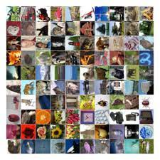
###### PCN is designed with convolutional layers stacked in both feedforward and feedback directions.

###### They trained and tested PCN for image classification with benchmark datasets.
<!-- # ----- ----- ----- Script ----- ----- ----- # -->
<!--
PCN is designed with convolutional layers stacked in both feedforward and feedback directions.

They trained and tested PCN for image classification with benchmark datasets.
CIFAR-10, CIFAR-100, SVHN, MNIST
-->
<!-- # ----- ----- ----- ----- ----- ----- ----- ----- # -->
---
<!-- # ----- ----- ----- Method : PCN ----- ----- ----- # -->
<!-- footer: Method -->
##### Predictive coding

###### Central to the theory of predictive coding is that the brain continuously generates top-down predictions of bottom-up inputs.

###### The representation at a higher level predicts the representation at its lower level.

###### The difference between the predicted and actual representation elicits an error of prediction, and propagates to the higher level to update its representation towards improved prediction.
<!-- # ----- ----- ----- Script ----- ----- ----- # -->
<!--
Central to the theory of predictive coding is that the brain continuously generates top-down predictions of bottom-up inputs.
The representation at a higher level predicts the representation at its lower level.
The difference between the predicted and actual representation elicits an error of prediction, and propagates to the higher level to update its representation towards improved prediction.
-->
<!-- # ----- ----- ----- ----- ----- ----- ----- ----- # -->
---

###### This repeats throughout the hierarchy until the errors of prediction diminish, or the bottom-up process no longer conveys any “new” (or unpredicted) information to update the hidden representation.
###### Thus, predictive coding is a computational mechanism for the model to recursively update its internal representations of the visual input towards convergence.

<!-- # ----- ----- ----- Script ----- ----- ----- # -->
<!--
This repeats throughout the hierarchy until the errors of prediction diminish, or the bottom-up process no longer conveys any “new” (or unpredicted) information to update the hidden representation.
Thus, predictive coding is a computational mechanism for the model to recursively update its internal representations of the visual input towards convergence.
-->
<!-- # ----- ----- ----- ----- ----- ----- ----- ----- # -->
---
###### PCNs were designed the "nonlinear" feedforward and feedback processes defined in Eq. (10) and (11) as a computational mechanism of predictive coding.
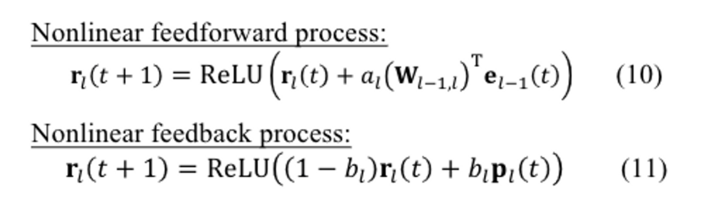
        

<!-- # ----- ----- ----- Script ----- ----- ----- # -->
<!--
PCNs were designed the "nonlinear" feedforward and feedback processes defined in Eq. (10) and (11) as a computational mechanism of predictive coding.
-->

---
<!-- # ----- ----- ----- figure 1 - a ----- ----- ----- # -->
<!-- _footer: Method : figure 1 - a -->
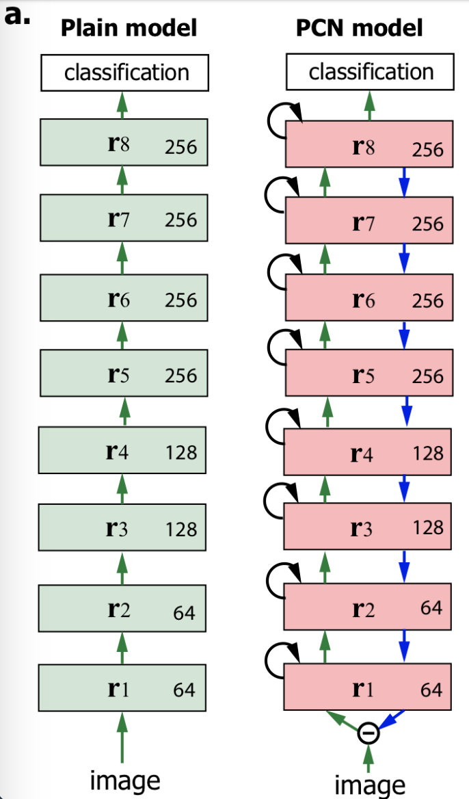

###### An  example  PCN  with  9  layers  and  its CNN counterpart(or  the  plain  model) ->
###### We can implemente this computational mechanismin several PCNs, all of which included stacked convolutional layers with feedforward, feedback, and recurrent connections as shown in Fig. 1a.

<!-- # ----- ----- ----- Script ----- ----- ----- # -->
<!--
We can implemente this computational mechanismin several PCNs, all of which included stacked convolutional layers with feedforward, feedback, and recurrent connections as shown in Fig. 1a.
-->

---

##### These PCNs were trained and tested for object recognition with four benchmark datasets:CIFAR-10, CIFAR-100, SVHN and MNIST.
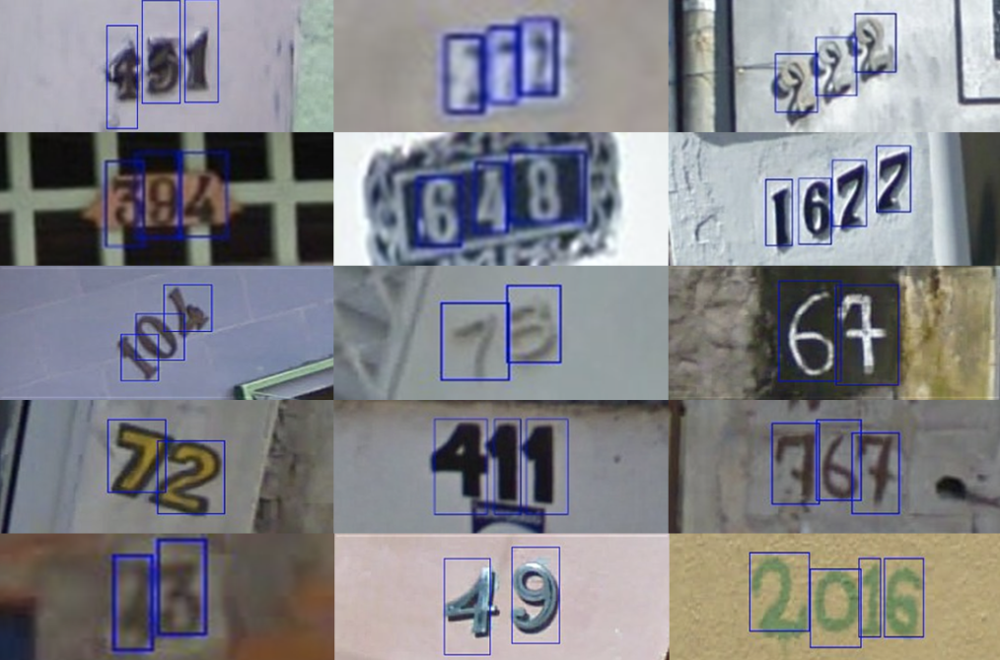

<!-- # ----- ----- ----- Script ----- ----- ----- # -->
<!--
These PCNs were trained and tested for object recognition with four benchmark datasets:CIFAR-10, CIFAR-100, SVHN and MNIST.
-->
---
###### For comparison, several feedforward-only CNNs were built with the same architecture as the feedforward pathway in corresponding PCNs, and were trained and tested with the same datasets.
###### We refer to these feedforward-only CNNs as the "plain networks", from which the PCNs were built upon by adding feedback and recurrent connections for dynamic processing.

<!-- # ----- ----- ----- Script ----- ----- ----- # -->
<!--
For comparison, several feedforward-only CNNs were built with the same architecture as the feedforward pathway in corresponding PCNs, and were trained and tested with the same datasets.
We refer to these feedforward-only CNNs as the "plain networks", from which the PCNs were built upon by adding feedback and recurrent connections for dynamic processing.
-->

---
<!-- # ----- ----- ----- figure 1 - b ----- ----- ----- # -->
<!-- _footer: Method : figure 1 - b -->
###### Two-layer  substructure  of  PCN. Feedback (blue), feedforward (green), and recurrent  (black)  connections  convey the  top-down prediction, the bottom-up prediction error, and the past information, respectively.
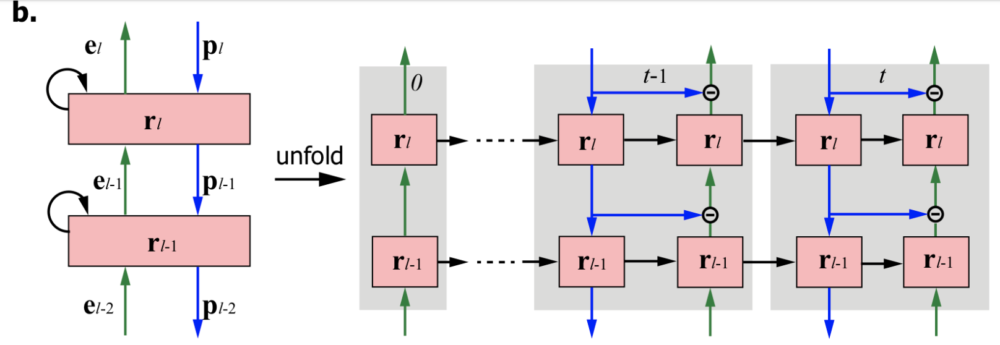

<!-- # ----- ----- ----- Script ----- ----- ----- # -->
<!--
Two-layer  substructure  of  PCN. Feedback (blue), feedforward (green), and recurrent  (black)  connections  convey the  top-down prediction, the bottom-up prediction error, and the past information, respectively.
-->

---

<!-- # ----- ----- ----- figure 1 - c ----- ----- ----- # -->
<!-- _footer: Method : figure 1 - c -->
###### The dynamic process in the PCN iteratively updates and refines the representation of visual  input over time.
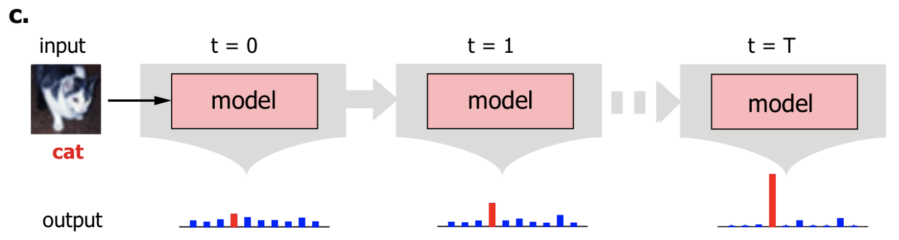

---
<!-- _footer: Method : figure 1 - c -->
###### PCN outputs the probability over candidate categories for object  recognition. The bar height indicates  the probability and the red indicates the ground truth.

---

> Plain CNN Models:
###### The architectural setting of our plain CNN models were similar to the "VGG nets" (Simonyan and Zisserman, 2014)(see Table 1).
###### Briefly, the basic architecture included 6 or 8 convolutional layers and 1 classification layer.
###### All convolutional layers used `3x3 filters` but different numbers of filters, and used `rectified linear unit (ReLU)` as the nonlinear activation function.

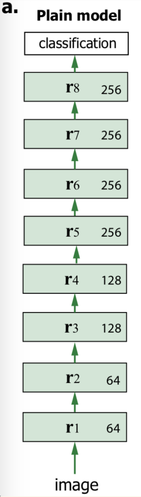

---

###### For some layers where the number of filters is doubled, the feature maps were reduced by `applying 2x2 max-pooling` with a `stride of 2` after convolution.
###### Batch normalization (Ioffe and Szegedy, 2015) was not used.
###### The `classification layer` included `global average pooling` and a `fully-connected` `(FC) layer` followed by `softmax`.
###### On the basis of this setting, we built 5 VGG-like architectures that varied in the number of layers and filters, and trained and tested the models with 4 datasets.

---
> Predictive Coding Network (PCN):
###### Starting from each of the plain CNN architectures, we added `feedback and recurrent connections` to form a corresponding PCN.
###### Fig. 1a shows a 9-layer PCN, running recursive bottom-up and top-down processing based on predictive coding.
###### In PCN, `feedback connections` from one layer to its lower layer were constrained to be the transposed convolution (Dumoulin and Visin, 2016)which is the transpose of the `feedforward counterparts`.
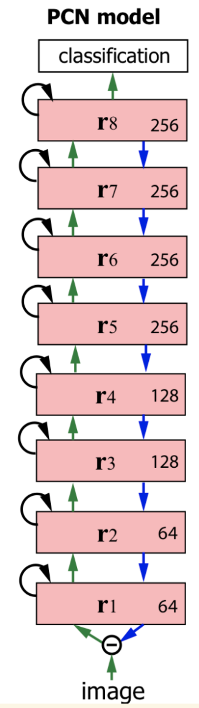

---

###### As such, both feedforward and feedback connections encoded spatial filters.
###### The former was applied to the "errors of the top-down prediction of lower-level representation"; the latter was applied to "high-level representation in order to predict the lower-level representation".
###### ***As in the brain, feedforward and feedback connections were reciprocal in PCN.***

---

###### The weights of feedback connections had the identical dimension as the transposed weights of feedforward connections.
###### For layers where max-pooling was applied after feedforward convolution, "bilinear upsampling was applied before feedback convolution to ensure" ***that the dimension of top-down prediction could match the dimension of lower-level representation.***
###### An optional constraint to PCN was to use `the same set of weights` for `both feedforward and feedback connections` as in some prior studies.

---

###### ***In other words, the weights of feedback connections were the transposed weights of feedforward connections.***
###### With this weight sharing, top-down predictions via feedback connections tended to approach lower-level representations.
###### The PCN would have the same number of parameters as the corresponding plain model.
###### Without this optional constraint of weight sharing, feedforward and feedback weights were assumed to be independent.

---
> Recursive Computation
###### Unlike feedforward-only networks, PCN runs a dynamic process to update its internal representation throughout the hierarchy (Fig. 1.b).
###### Given an input image, PCN first runs through the feedforward path from the input layer to the last convolutional layer at `𝒕= 𝟎`, equivalent to a plain CNN model.
###### For `𝒕= 𝟏`, PCN first runs a feedback process and then a feedforward process to update the representations in the hierarchy.

---

###### In the feedback process, the representation at each layer is updated by a `top-down prediction from the higher layer` according to Eq. (11).
###### The `feedback process` runs from the highest convolutional layer to the input layer.
###### In the feedforward process, the representation at each layer is updated by a `bottom-up` `error` according to Eq. (10).
###### This procedure is repeated over time as shown in Fig. 1.b.
###### After some cycles, the representation is used as the `input to the classification layer` to classify the image(see Algorithm 1).
---
> Model Training
###### We evaluated `two types` of PCNs with regard to an optional constraint: ***the feedforward and feedback connections share the same convolutional weights.***
###### With `this weight sharing`, the feedforward operation and the feedback operation use the same weights.
###### Without the constraint, the feedforward and feedback weights are initialized independently.

---

###### In this work, we evaluated these two types of PCNs with a varying number of `recursive cycles(𝑡=0,1,2,⋯,6)` and with different model architectures (labeled as A through Ein Table 1).
###### We use `Plain-A` to represent the plain network with architecture A, and use `PCN-A-t`  to represent the PCN with architecture A and 𝑡 cycles of recursive computation.
###### The numbers of recursive cycles for training and testing a model are the same.
---

###### PCN-A-t (tied) and PCN-A-t represent the PCNs with and without weight sharing, respectively.
###### We used "PyTorch" (Paszke et al., 2017) to implement, train, and test the models described above.
###### ***When PCN is trained for image classification, the classification error backpropagates across  layers  and  in  time  to  update  the model parameters.***
---
###### The  feedforward  and  feedback  update rates (𝑎 𝑙 and 𝑏 𝑙) are set to `be specific to each filter in each layer`, are constrained to be non-negative by using ReLU, and are trained with initialvalues `𝑎 𝑙=1.0 and 𝑏 𝑙=0.5, respectively.`
###### The convolutional weights and linear weights were initialized to be uniformly random (the default setting in PyTorch).
###### `The models were trained using mini-batches of a size  128`  and  without  using  drop out regularization (Srivastava et al., 2014).

---

<!-- _footer: Method : figure 2 -->

---
