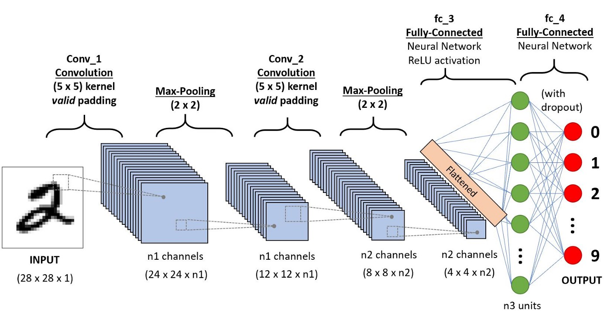
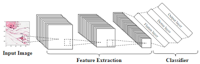
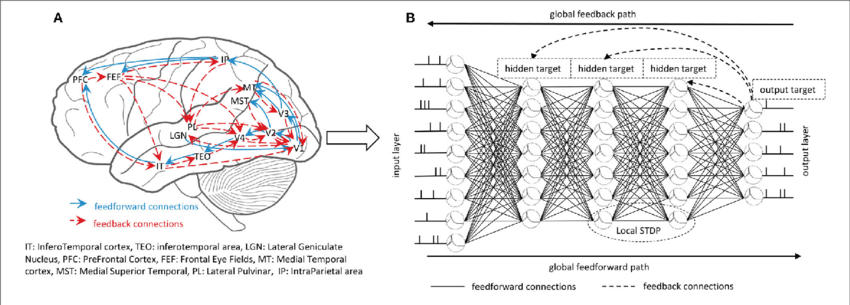
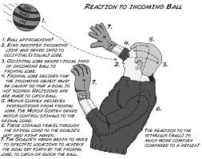
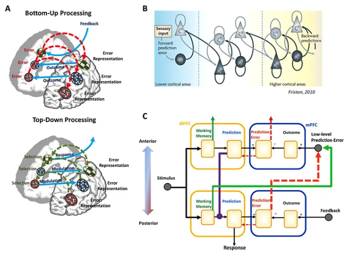
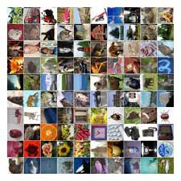
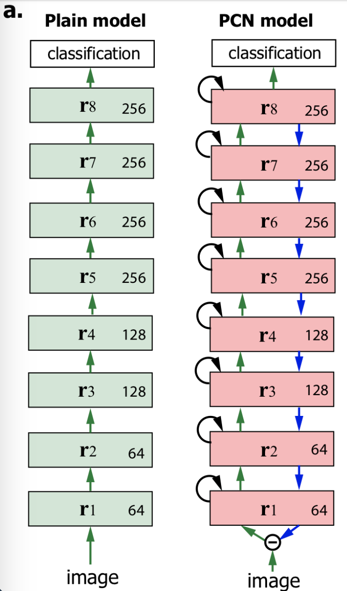
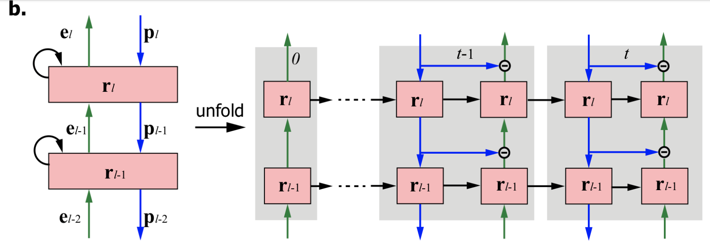
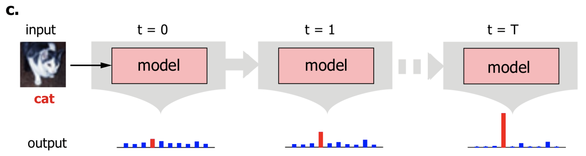

## Deep Predictive Coding Network for Object Recognition

###### 2018
###### Haiguang Wen, Kuan Han, Junxing Shi, Yizhen Zhang, Eugenio Culurciello, Zhongming Liu

---
<!-- # ----- ----- ----- The Definition of the PCN ----- ----- ----- # -->
<!-- footer: Deep Predictive Coding Network for Object Recognition -->
<!-- _backgroundColor: white -->

###  Predictive Coding Networks (PCN)

##### Based on the predictive coding theory in neuroscience,it was designed a bi-directional and recurrent neural net

---
<!-- # ----- ----- ----- keywards for PCN ----- ----- ----- # -->
#### Predictive Coding Networks (PCN)
##### keywards
- feedforward
- feedback
- recurrent connections
- bottom-up
- top-down

---
<!-- # ----- ----- ----- intro PCN 1 ----- ----- ----- # -->
<!-- footer: Introduction -->

###### CNNs have achieved great success in image recognition.

###### CNNs have improved the performance in CV(Computer Vision), while these models generally become deeper and wider by using more layers or/and fillters.

<!-- # ----- ----- ----- Script ----- ----- ----- # -->
<!--
CNNs have achieved great success in image recognition.
CNNs have improved the performance in CV(Computer Vision), while these models generally become deeper and wider by using more layers or/and fillters. For example, AlexNet, VGG, GoogLeNet, ResNet, ...
-->
<!-- # ----- ----- ----- ----- ----- ----- ----- ----- # -->
---

###### Despite various ways of architectural reconfiguration, 
###### these models all scale up from the same principle of computation

###### : extracting image features by a feedforward pass through stacks of convolutional layers.

<!-- # ----- ----- ----- Script ----- ----- ----- # -->
<!-- 
Despite various ways of architectural reconfiguration, these models all scale up from the same principle of computation: extracting image features by a feedforward pass through stacks of convolutional layers.
-->
<!-- # ----- ----- ----- ----- ----- ----- ----- ----- # -->
--- 

###### **_Unlike CNNs_**, the brain achieves robust visual perception by using feedforward, feedback and recurrent connections(Felleman & Van, 1991)
     
###### Such bi-directional processes enable humans to perform a wide range of visual tasks, including object recognition.

<!-- # ----- ----- ----- Script ----- ----- ----- # -->
<!-- 
Although it is inspired by hierarchical processing in biological visual systems,
CNN differs from the brain in many aspects.
**_Unlike CNNs_**, the brain achieves robust visual perception by using feedforward, feedback and recurrent connections.

Information is processed not only through a bottom-up path-way running from lower to higher visual areas, but also through a top-down pathway running in the opposite direction.
Such bi-directional processes enable humans to perform a wide range of visual tasks, including object recognition.
-->
<!-- # ----- ----- ----- ----- ----- ----- ----- ----- # -->
---

###### For human vision, feedforward processing is essential to rapid recognition,
###### when visual input is too brief to recruit feedback and recurrent processing.

<!-- # ----- ----- ----- Script ----- ----- ----- # -->
<!-- 
For human vision, feedforward processing is essential to rapid recognition, when visual input is too brief to recruit feedback and recurrent processing.
-->
<!-- # ----- ----- ----- ----- ----- ----- ----- ----- # -->
---

###### However, feedback processing improves object recognition and enables cognitive processes to influence perception.

###### In neuroscience, the interplay between feedforward and feedback processes is described by hierarchical predictive coding.

<!-- # ----- ----- ----- Script ----- ----- ----- # -->
<!--
However, feedback processing improves object recognition and enables cognitive processes to influence perception.
In neuroscience, the interplay between feedforward and feedback processes is described by hierarchical predictive coding.
-->
<!-- # ----- ----- ----- ----- ----- ----- ----- ----- # -->
---
###### It states that the feedback connections from a higher visual area to a lower visual area carry predictions of lower-level neural activities;

###### feedforward connections carry the errors between the predictions and the actual lower-level activities.

###### As a result, the brain dynamically updates its representations to progressively refine its perceptual and behavioral decisions.

<!-- # ----- ----- ----- Script ----- ----- ----- # -->
<!--
It states that the feedback connections from a higher visual area to a lower visual area carry predictions of lower-level neural activities;
feedforward connections carry the errors between the predictions and the actual lower-level activities.
As a result, the brain dynamically updates its representations to progressively refine its perceptual and behavioral decisions.
-->
<!-- # ----- ----- ----- ----- ----- ----- ----- ----- # -->
---
<!-- # ----- ----- ----- intro PCN 2 ----- ----- ----- # -->

##### PCN is a bi-directional and recurrent neural net.
###### Given image input to PCN, it runs recurisve cycles of bottom-up and top-down computation to update its internal representations towards minimizations of the residual error between bottom-up input and top-down prediction at every layer in the network.

###### Using predictive coding as its computational mechanism, PCN differs from feedforward-only CNNs that currently dominate computer vision.

<!-- # ----- ----- ----- Script ----- ----- ----- # -->
<!--
PCN is a bi-directional and recurrent neural net.
Given image input to PCN, it runs recurisve cycles of bottom-up and top-down computation to update its internal representations towards minimizations of the residual error between bottom-up input and top-down prediction at every layer in the network.
Using predictive coding as its computational mechanism, PCN differs from feedforward-only CNNs that currently dominate computer vision.
-->
<!-- # ----- ----- ----- ----- ----- ----- ----- ----- # -->
---
###### It is a model with dynamics that uses recursive and bi-directional computation to extract better representations of the input such that the input is predictable by the internal representation.

###### When it is unfolded in time, PCN runs a longer cascade of nonlinear transformations by running more cycles of bottom-up and top-down computation through the same architecture without adding more layers, units, or connections.
<!-- # ----- ----- ----- Script ----- ----- ----- # -->
<!--
It is a model with dynamics that uses recursive and bi-directional computation to extract better representations of the input such that the input is predictable by the internal representation.

When it is unfolded in time, PCN runs a longer cascade of nonlinear transformations by running more cycles of bottom-up and top-down computation through the same architecture without adding more layers, units, or connections.
-->
<!-- # ----- ----- ----- ----- ----- ----- ----- ----- # -->
---

###### PCN is designed with convolutional layers stacked in both feedforward and feedback directions.

###### They trained and tested PCN for image classification with benchmark datasets.
<!-- # ----- ----- ----- Script ----- ----- ----- # -->
<!--
PCN is designed with convolutional layers stacked in both feedforward and feedback directions.

They trained and tested PCN for image classification with benchmark datasets.
CIFAR-10, CIFAR-100, SVHN, MNIST
-->
<!-- # ----- ----- ----- ----- ----- ----- ----- ----- # -->
---
<!-- # ----- ----- ----- Method : PCN ----- ----- ----- # -->
<!-- footer: Method -->
##### Predictive coding

###### Central to the theory of predictive coding is that the brain continuously generates top-down predictions of bottom-up inputs.

###### The representation at a higher level predicts the representation at its lower level.

###### 

<!-- # ----- ----- ----- Script ----- ----- ----- # -->
<!--

-->
<!-- # ----- ----- ----- ----- ----- ----- ----- ----- # -->
---

<!-- # ----- ----- ----- Script ----- ----- ----- # -->
<!--

-->
<!-- # ----- ----- ----- ----- ----- ----- ----- ----- # -->

---
<!-- # ----- ----- ----- figure 1 - a ----- ----- ----- # -->
#### figure 1 - a

- figure 1 - a
---
<!-- # ----- ----- ----- figure 1 - b ----- ----- ----- # -->
#### figure 1 - b

- figure 1 - b
---

<!-- # ----- ----- ----- figure 1 - b ----- ----- ----- # -->
#### figure 1 - c

- figure 1 - c
---

