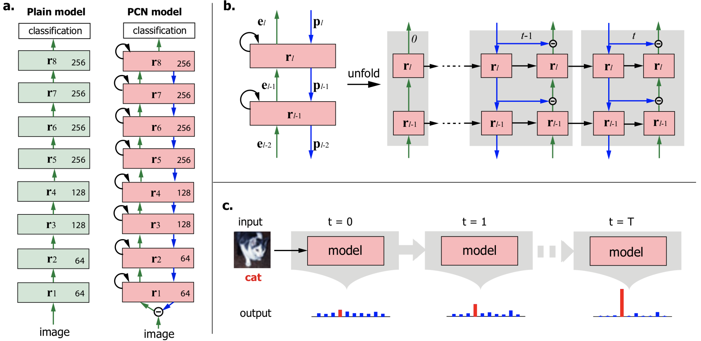

## Deep Predictive Coding Network for Object Recognition

###### 2018
###### Haiguang Wen, Kuan Han, Junxing Shi, Yizhen Zhang, Eugenio Culurciello, Zhongming Liu

---
<!-- # ----- ----- ----- The Definition of the PCN ----- ----- ----- # -->
<!-- footer: Deep Predictive Coding Network for Object Recognition -->
<!-- _backgroundColor: white -->

###  Predictive Coding Networks (PCN)

##### Based on the predictive coding theory in neuroscience, it was designed a bi-directional and recurrent neural net
---
<!-- # ----- ----- ----- Explaination for PCN ----- ----- ----- # -->

---

### figure 1

- figure 1
---

